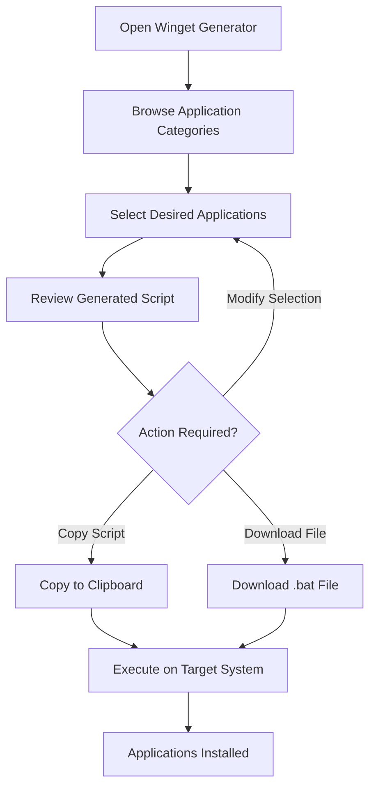
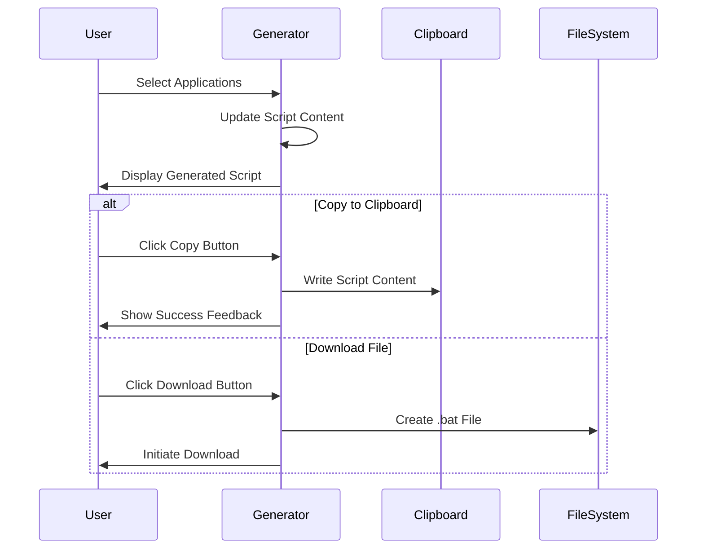
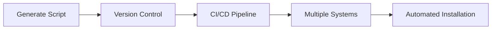

# xsukax Winget Generator - XWGG

A modern, privacy-focused web application that generates Windows Package Manager (winget) batch scripts for streamlined software installation across Windows environments.

[](https://www.gnu.org/licenses/gpl-3.0)
[](https://pages.github.com/)
[](https://github.com/yourusername/winget-generator)

## Project Overview

xsukax Winget Generator - XWGG is a sophisticated web-based tool designed to simplify the process of creating automated installation scripts for Windows applications. Built with modern web technologies and an Apple-inspired design aesthetic, it provides system administrators, developers, and power users with an intuitive interface to generate comprehensive batch scripts leveraging Microsoft's Windows Package Manager (winget).

The application curates over 354 essential applications across 12 distinct categories, enabling users to select their desired software packages and generate ready-to-execute batch scripts. This approach significantly reduces deployment time and ensures consistent software installations across multiple Windows systems.

### Key Capabilities

- **Comprehensive Software Library**: Access to 354+ applications spanning security tools, development environments, multimedia software, and productivity suites
- **Real-time Script Generation**: Dynamic creation of Windows batch scripts based on user selections
- **Zero-Configuration Deployment**: No installation required - runs entirely in web browsers
- **Cross-Platform Accessibility**: Compatible with any device capable of running a modern web browser
- **Offline Functionality**: Full operation without internet connectivity after initial page load

## Security and Privacy Benefits

### Client-Side Architecture
The application operates entirely within the user's browser, implementing a client-side-only architecture that fundamentally eliminates common security and privacy concerns associated with server-based applications.

### Data Privacy Guarantees
- **No Data Collection**: Zero telemetry, analytics, or user behavior tracking
- **No Server Communication**: All operations performed locally without external API calls
- **No Authentication Required**: No user accounts, passwords, or personal information storage
- **No Local Storage Usage**: Deliberately avoids browser localStorage and sessionStorage APIs
- **Session Isolation**: Each browser session operates independently with no persistent data

### Security Measures
- **No External Dependencies**: Eliminates supply chain attack vectors through self-contained operation
- **Content Security**: All resources served from trusted CDN sources (cdnjs.cloudflare.com)
- **Open Source Transparency**: Complete source code availability for security auditing
- **No JavaScript Vulnerabilities**: Minimal external script dependencies reduce attack surface

### Trust and Transparency
- **Verifiable Behavior**: All functionality can be inspected through browser developer tools
- **Reproducible Results**: Generated scripts are deterministic and auditable
- **No Hidden Functionality**: Complete transparency in operation and data handling

## Features and Advantages

### User Experience
- **Modern Interface Design**: Apple-inspired glassmorphism UI with sophisticated visual effects
- **Responsive Layout**: Optimized for desktop, tablet, and mobile devices
- **Intuitive Navigation**: Logical categorization and search-friendly organization
- **Real-time Feedback**: Immediate visual confirmation of selections and script updates

### Technical Advantages
- **High Performance**: Lightweight implementation with minimal resource consumption
- **Browser Compatibility**: Support for all modern web browsers (Chrome, Firefox, Safari, Edge)
- **Accessibility Compliance**: Proper ARIA labels and keyboard navigation support
- **Progressive Enhancement**: Graceful degradation on older browser versions

### Operational Benefits
- **Rapid Deployment**: Generate installation scripts in seconds
- **Consistency Assurance**: Standardized software installations across environments
- **Version Control Friendly**: Generated scripts suitable for source control integration
- **Automation Ready**: Scripts compatible with deployment automation pipelines

### Unique Selling Points
- **Curated Application Database**: Hand-selected, frequently updated software packages
- **Category-Based Organization**: Logical grouping for efficient software discovery
- **Batch Operation Support**: Select multiple applications across categories simultaneously
- **Professional Output**: Clean, commented batch scripts with proper error handling

## Installation Instructions

### Prerequisites
- Modern web browser (Chrome 90+, Firefox 88+, Safari 14+, Edge 90+)
- Internet connection for initial download (optional for subsequent use)

### Deployment Options

#### Option 1: GitHub Pages (Recommended)
```bash
# Access the live application
https://xsukax.github.io/xwgg/
```

#### Option 2: Local Installation
```bash
# Clone the repository
git clone https://github.com/xsukax/xwgg.git

# Navigate to project directory
cd xwgg

# Open in web browser
# Windows
start index.html

# macOS
open index.html

# Linux
xdg-open index.html
```

#### Option 3: Web Server Deployment
```bash
# For Apache/Nginx deployment
# Copy enhanced_winget_generator.html to web root directory
cp index.html /var/www/html/

# Configure web server to serve static files
# No special server configuration required
```

#### Option 4: Development Environment
```bash
# Using Python's built-in server
python -m http.server 8000

# Using Node.js serve package
npx serve .

# Access via http://localhost:8000
```
#### Option 5: Build image using Dockerfile
1- Clone xwgg project
```sh
git clone https://github.com/xsukax/xwgg.git
```
```sh
cd xwgg
```
2- Build nginx alpine image
```sh
sudo docker build -t xsukax-xwgg .
```
3- Create a Container
```sh
sudo docker run -d -p 8088:80 --name xsukax-xwgg xsukax-xwgg:latest
```
4- Check localhost url<br/>
http://localhost:8088

## Usage Guide

### Basic Workflow



### Step-by-Step Instructions

#### 1. Application Selection
1. **Access the Interface**: Open the Winget Generator in your web browser
2. **Review Statistics**: Note the total number of available applications and categories
3. **Browse Categories**: Explore organized software categories:
   - Security & Privacy
   - Web Browsers
   - Communication & Social
   - Office & Productivity
   - Developer Tools
   - Gaming & Entertainment
   - System Utilities
   - Multimedia
   - Graphics & Design
   - Finance & Business
   - Education & Research
   - Streaming & Entertainment

#### 2. Software Selection Process
1. **Navigate Categories**: Click on category cards to view available applications
2. **Select Applications**: Check boxes next to desired software packages
3. **Monitor Progress**: Observe real-time updates to selection counter
4. **Review Choices**: Verify selected applications across multiple categories

#### 3. Script Generation and Export



#### 4. Script Execution on Target Systems
1. **Transfer Script**: Copy script content or transfer downloaded .bat file to target Windows system
2. **Administrative Privileges**: Ensure execution with administrator rights
3. **Execute Script**: Run the batch file to initiate automated installation process
4. **Monitor Progress**: Observe winget installation progress for each selected application

### Advanced Usage Patterns

#### Bulk System Deployment


#### Custom Script Integration
1. **Modify Generated Scripts**: Edit batch files to include custom logic
2. **Environment Variables**: Incorporate system-specific configurations
3. **Error Handling**: Add additional logging and error recovery mechanisms
4. **Integration Points**: Combine with existing deployment automation tools

### Troubleshooting Common Issues

| Issue | Cause | Solution |
|-------|-------|----------|
| Script not generating | JavaScript disabled | Enable JavaScript in browser |
| Copy function not working | Browser security restrictions | Use manual copy or download option |
| Applications not installing | Administrative privileges required | Run script as administrator |
| Winget not found | Windows Package Manager not installed | Install winget from Microsoft Store |

## Licensing Information

### GNU General Public License v3.0

This project is licensed under the GNU General Public License v3.0 (GPL-3.0), which provides the following rights and obligations:

#### User Rights
- **Freedom to Use**: Unrestricted use of the software for any purpose
- **Freedom to Study**: Access to source code and the right to examine how the software works
- **Freedom to Modify**: Right to change the software to suit your needs
- **Freedom to Distribute**: Permission to redistribute copies to help others

#### Developer Obligations
- **Source Code Availability**: Modified versions must include source code
- **License Preservation**: Derivative works must be licensed under GPL-3.0
- **Attribution Requirements**: Original copyright notices must be maintained
- **No Additional Restrictions**: Cannot impose further limitations on recipient rights

#### Commercial Use
The GPL-3.0 license permits commercial use, modification, and distribution, provided that:
- Source code is made available to recipients
- The same license terms are applied to derivative works
- Clear attribution is provided to original authors

#### Patent Protection
The license includes explicit patent grant and retaliation clauses, providing protection against patent lawsuits related to the licensed software.

For the complete license text, see the [LICENSE](LICENSE) file in the project repository or visit [GNU GPL v3.0](https://www.gnu.org/licenses/gpl-3.0.en.html).

---

## Contributing

We welcome contributions to improve xsukax Winget Generator - XWGG. Please read our contributing guidelines and ensure all submissions comply with the GPL-3.0 license requirements.

## Support

For questions, issues, or feature requests, please use the GitHub Issues system. Community support and discussions are available through GitHub Discussions.

## Acknowledgments

Built with modern web technologies and inspired by Apple's design principles, xsukax Winget Generator aims to provide a premium user experience while maintaining the highest standards of privacy and security.
